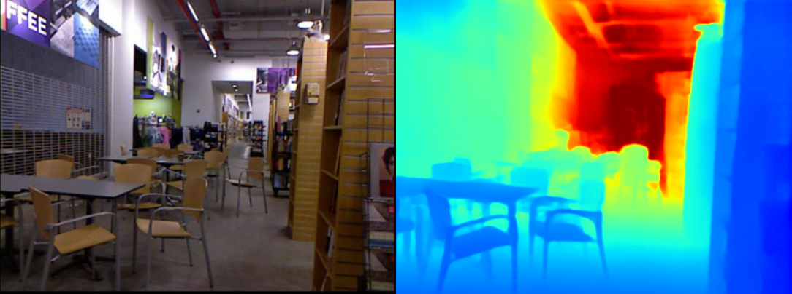
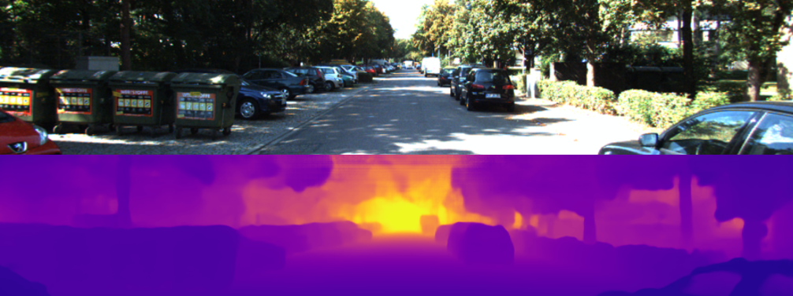

# D-Net
D-Net: A Generalised and Optimised Deep Network for Monocular Depth Estimation
Paper available on [IEEE Access](https://pages.github.com/](https://ieeexplore.ieee.org/document/9551940)https://ieeexplore.ieee.org/document/9551940)

## Sample Prediction Result for the NYUv2 Dataset


## Sample Prediction Result for the KITTI Dataset


## Note
All training and testing data was gathered using the approach decsribed in the [From Big to Small](https://github.com/cleinc/bts/tree/master) repository. Refer to their github for instructions and code to dowload the full training and testing datasets.

## Preparation For Usage
```console
$ cd ~
$ mkdir workspace
$ cd workspace
### Make a folder for datasets
$ mkdir dataset
### Clone this repo
$ git clone https://github.com/Joshuat38/D-Net.git
```
## Prepare the NYUv2 and KITTI Training Datasets
Please refer to [From Big to Small](https://github.com/cleinc/bts/tree/master/pytorch) for instructions under their pytorch section.

## Prepare the NYUv2 and KITTI Test Datasets
Please refer to [From Big to Small](https://github.com/cleinc/bts/tree/master) for instructions.

## Model Zoo
### NYU Depth V2 Performance (Most Recent Update)

| Base Network       |   d1  |   d2  |   d3  | AbsRel |  RMSE | log10 | #Params |         Model Download         |
|:------------------:|:-----:|:-----:|:-----:|:------:|:-----:|:-----:|:-------:|:------------------------------:|
| Efficientnet-B0    | 0.867 | 0.977 | 0.995 |  0.112 | 0.412 | 0.050 |   13.8M | [d-net_nyu_v2_efficientnet_b0](https://drive.google.com/drive/folders/1kwXMRAzwm-VPUq6mgIGt6KCL5NSgHfIt?usp=sharing)  |
| ResNet101          | 0.889 | 0.980 | 0.995 |  0.108 | 0.381 | 0.046 |   77.7M | Not Available |
| Efficientnet-B7    | 0.907 | 0.987 | 0.997 |  0.100 | 0.359 | 0.043 |   89.8M | [d-net_nyu_v2_efficientnet_b7](https://drive.google.com/drive/folders/11pMsHmgkGZhuPyBR6riP_yaOR_oUMLA2?usp=sharing) |
| Swin-B             | 0.923 | 0.988 | 0.997 |  0.094 | 0.346 | 0.040 |  116.0M | [d-net_nyu_v2_swin-b](https://drive.google.com/drive/folders/1sMTf7xLS7ZV8odTwEBEQ8Ky7taZHNT7C?usp=sharing)  |
| Swin-L             | 0.932 | 0.989 | 0.998 |  0.090 | 0.330 | 0.039 |  231.2M | [d-net_nyu_v2_swin-l](https://drive.google.com/drive/folders/1NrmKMcS5qMrdtl7riWtjiiWiZbVoDjtA?usp=sharing) |

### KITTI Depth Eigen Performance

| Base Network       |   d1  |   d2  |   d3  | AbsRel | SqRel |  RMSE | RMSElog | #Params |          Model Download          |
|:------------------:|:-----:|:-----:|:-----:|:------:|:-----:|:-----:|:-------:|:-------:|:--------------------------------:|
| Efficientnet-B0    | 0.955 | 0.994 | 0.999 |  0.064 | 0.235 | 2.608 |   0.097 |    8.2M | [d-net_kitti_eigen_efficientnet_b0](https://drive.google.com/drive/folders/1wEkA-0fb4ZdxScIzEn9hUTRhxrGMpFzf?usp=sharing)  |
| Efficientnet-B7    | 0.965 | 0.995 | 0.999 |  0.057 | 0.199 | 2.432 |   0.089 |    80.4M | [d-net_kitti_eigen_efficientnet_b7](https://drive.google.com/drive/folders/1JqVD7TpfVcUFFxAbw7BHN0ggJn3rfHYX?usp=sharing)  |
| HRNet64            | 0.963 | 0.995 | 0.999 |  0.056 | 0.189 | 2.362 |   0.087 |   144.1M | [d-net_kitti_eigen_hrnet64](https://drive.google.com/drive/folders/1HaoajEHsa7pJxeWp49CxGahwtNxc7okJ?usp=sharing)  |

## Using the code
Once you have downloaded and extracted the datasets and any pretrained models you intend to use, you can now start to play with the code.

### Training
To train the model on NYUv2 or KITTI, you will need to add the path to your dataset in the arg_files for either arguments_train_nyu.txt or arguments_train_kitti_eigen.txt. Then you simply run the command:
```shell
$ cd ~/workspace/d-net
$ python train.py arguments_train_nyu.txt
```
or 
```shell
$ cd ~/workspace/d-net
$ python train.py arguments_train_kitti_eigen.txt
```

Provided the dataset is formatted correctly, the model should start training.

### Testing
To test the model on NYUv2 or KITTI, you will need to add the path to your dataset in the arg_files for either arguments_test_nyu.txt or arguments_test_kitti_eigen.txt. Then you simply run the command:
```shell
$ cd ~/workspace/d-net
$ python test.py arguments_test_nyu.txt
```
or 
```shell
$ cd ~/workspace/d-net
$ python test.py arguments_test_kitti_eigen.txt
```

Provided the dataset is formatted correctly, the model should start testing and giving the test outputs.

### Inference
The inference code is used to do any of the following:
- Generate visual results for the test sets of NYUv2 or KITTI.
- Produce a depth map for a custom image.
- Produce a depth map for a custom video (video is not saved).
- Live stream directly to a webcam (stream is not saved).

To do this, you will need to select the mode (see inference.py for this), and then select the video or image files, camera id or add the path to your dataset in the arg_files for either arguments_inference_nyu.txt or arguments_inference_kitti.txt.

Then simply run:
```shell
$ cd ~/workspace/d-net
$ python inference.py arguments_inference_nyu.txt
```
or 
```shell
$ cd ~/workspace/d-net
$ python inference.py arguments_inference_kitti.txt
```

## Using the GUI
We have included a GUI which is built on QT-5 which can connect to any webcam. The results may vary depending on the focal length of the camera.

To use the gui, simple run the command:
```shell
$ python viewer.py
```

### Image of the GUI Home Page


The GUI will open and you can use the settings button to choose the model, the depth button to view the depth output in colours and the contours button to view the depth output with contours overlaid. Be sure to select the number of contours you want in the settings. Generally, 10 is a good number.

## Citation
If you find this work useful for your research, please consider citing our paper:
```
@article{thompson2021d,
  title={D-Net: A Generalised and Optimised Deep Network for Monocular Depth Estimation},
  author={Thompson, Joshua Luke and Phung, Son Lam and Bouzerdoum, Abdesselam},
  journal={IEEE Access},
  volume={9},
  pages={134543--134555},
  year={2021},
  publisher={IEEE}
}
```

## License
Copyright (C) 2021 Joshua Luke Thompson, Son Lam Phung and Abdesselam Bouzerdoum \
This Software is licensed under CC-BY-NC-ND-4.0-or-later.
